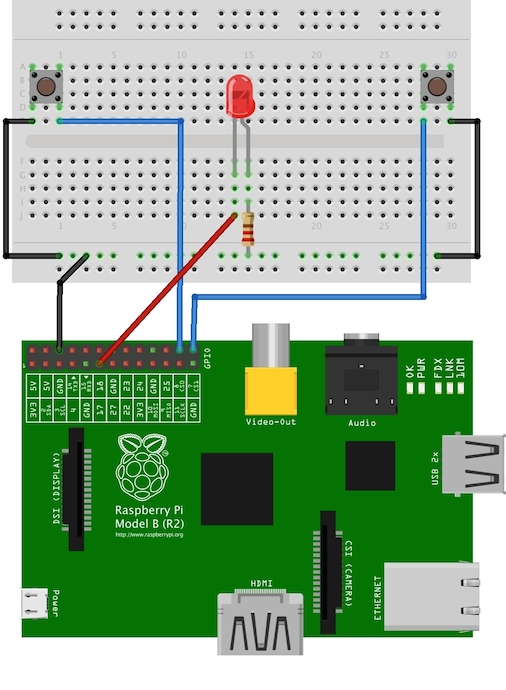
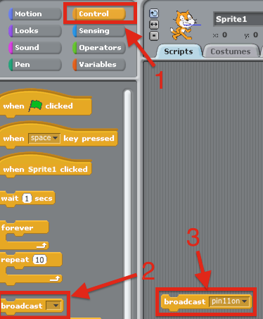
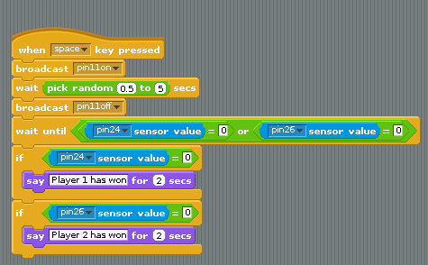

## ScratchGPIO Quick Reaction Game

**Introduction**

This project gives you the opportunity to use electronics to create a quick reaction game that you will program using Scratch. If you have little or no experience of creating circuits do not worry, this guide will walk you through it and by the end you will have a fun game to play with your friends.

## Step 0: Setting up your Raspberry Pi

You will need to set up your Raspberry Pi to take part in this activity. See the [Raspberry Pi Start Guide here](http://www.raspberrypi.org/help/quick-start-guide/) to get you up and running.

You will require the following components in order to create this game with your Raspberry Pi.
- A half size breadboard
- LED
- A resistor
- Four female to male jumper wires
- Two male to male jumper wires
- Two tactile buttons

## Step 1: Connect the Components

Before using ScratchGPIO the program the game, you will need to connect the electronic components on a **breadboard** that has lots of holes in it allowing you to connect electrical bits together really easily. To help know which pins to connect cables to it is recommended that you download and print a [Raspberry Leaf](https://github.com/simonmonk/wiki_images/raw/master/raspberry%20leaf%20r2.pdf) diagram and place it over the pinson your Raspberry Pi.

**Activity Checklist:**

1. Begin by placing all the components on a desk and make sure that you have space to work. Lay the breadboard lenthways (landscape).

2. Take one of your tactile buttons and push it into the holes on your breadboard, with one set of legs on row `A` and one set of legs on row `C`.

3. Repeat the last step with the second button only placing it at the other end of the breabdoard on the same row. See the diagram below.

4. Place an LED with the longer leg above the ridge in the breadboard in `H16` and the shorter leg in `G15` (the numbering will depend on your breadboard so make sure that you check the diagram below).

5. Next push one leg of the resistor into the same coloumn `15` as the short leg of the resistor and the other leg into a hole along the blue strip.

6. Time to add the jumper wires. Start by taking two male to male jumper wires and placing one side in a hole next to the outside leg of the left hand button, and the other leg in a hole along the blue strip. Repeat this step with the right hand button.

7. Then with a male to female jumper wire, connect **GPIO 8** to a hole on the breadboard in line with the other leg of the left hand button. Repeat this step for the right hand button, only this time connecting it to **GPIO 7**.

8. Using another male to female jumper wire, connect **GPIO 17** to a hole on the breadboard in line with the long leg of the LED.

9. Finally with the remaining male to female jumper wire, connect a **GND** GPIO pin to the blue strip on the breadboard.

	

## Step 2: Controlling the Light

When programming it makes sense to tackle one problem at a time. This makes it easier to test your project at various stages. In this step you will use ScratchGPIO to control the Raspberry Pi GPIO.

1. Launch ScratchGPIO (Should be on the desktop, make sure not to open the *plus* version).   
2. Grab a broadcast from the control section and set it to ```pin11on``` (using the small black arrow and selecting ```new...```)   
   
3. Grab a ```When space key pressed``` block, again from the control section at attach it above the broadcast block.   
  
4. Hit the space bar! Your LED should light! (If not, check your wiring. If it still isn't working, call over a mentor).
5. Now we have an LED on, we need a way to turn it off. In ScratchGPIO, this is really simple to do. Just add a broadcast ```pin11off``` (and a wait 1 second block from control section in between).   
   
6. Now when you hit the space bar, the LED should come on, wait 1 second, then go off.  

## Step 3: Adding an Element of Surprise

The object of the game is to see who can press the button first when the light goes out so it would be better if the length of time it stayed on for were random.    
To generate a random number in Scratch, we use the ```Pick random 1 to 10``` block which can be found in the ```Operators``` section.

1. Grab a ```Pick random 1 to 10``` from the ```Operators``` section and slot it into the 1 second gap in the wait block.   
 
2. Adjust the 2 values provided to ```pick random```. The value to the left is the minimum random number that could be generated while the value to the right is the maximum value that could be generated. 
So by default it could generate between 1 and 10. That is a little high, lets change it. Pick your own numbers.   
 

## Step 4: Detecting the Buttons

The LED is working, now you want to add functionality to your program so that when a button is pressed it is detected. That way you can record the scores of the players to see who wins. The way to do this is using a wait until block in Scratch.   

**Activity Checklist:**

1. Grab a ```wait until``` block from ```Control``` and an ```or``` block from ```Operators```.   
   
2. Also from the ```Operators``` section, grab 2 ```=``` blocks and drag them.   
   
3. Now grab 2 ```Sensor value``` block from the ```Sensing``` section. Set one to pin24 and the other to pin26. Then set the other side of the ```=``` to 0.   
The reason we set it to 0 is when the button is pressed, ```pin24 sensor value``` will be equal to 0, when the button is not pressed it is equal to 1.   
    
4. Now we know when one of the 2 buttons is pressed, we need to figure out if it was player 1 or player 2 who pressed the button. To do this, grab 2 ```If``` blocks from the ```Control``` section and attach them below each other (not inside each other).   
 
5. Finally, duplicate the ```=``` blocks from above, one into each of the if statements and add a message using the ```Say``` block from the ```Looks``` section to say who has won.   
 
4. Save your program and test it with a friend.

## Step 5: Get Player Names

Wouldn't it be better if the program told you who has won instead of just which button was pressed? For this, you need to find out the players names. In Scratch we can use the ```Ask``` and ```Answer``` blocks.

**Activity Checklist:**

1. First, we need to create a variable to store the users name. Think of variables as a box. In Scratch, you can put any type of data in this box, like a name for example!
Hit ```Make a variable```, give it a decent name (like LeftPlayer for example) and hit ok.   

2. Create a second variable for the right player name.
3. Lets try and edit the contents of the variable. Grab a ```Set to``` block from the variables sections and select which variable you want to edit. Then set it to something, for example a name.   

4. This method requires you to directly edit your code to set the names, this is not what we want, we want the computer to ask each time the program is run. To do this, we use the ```ask and wait``` and ```answer``` blocks.   
This allows us to ask the user a question, then grab whatever they type in (so we can store it in our variable permanently).   

5. Then repeat this for the right player too.   
So we should end up with something along the lines of this.   


## Things to try:

- Add scores for both players that accumilate over a number of rounds.

## Community

This activity is based on the work of [Joseph Haig at his Code Club](https://github.com/jrmhaig/rpi_projects) and rewitten for ScratchGPIO by [Andrew Mulholland](https://github.com/gbaman) for the Northern Ireland Raspberry Jam.

## Licence

Unless otherwise specified, everything in this repository is covered by the following licence:


***Quick Reaction Game*** by the [Raspberry Pi Foundation](http://raspberrypi.org) is licenced under a [Creative Commons Attribution 4.0 International License](http://creativecommons.org/licenses/by-sa/4.0/).

Based on a work at https://github.com/raspberrypilearning/quick-reaction-game
